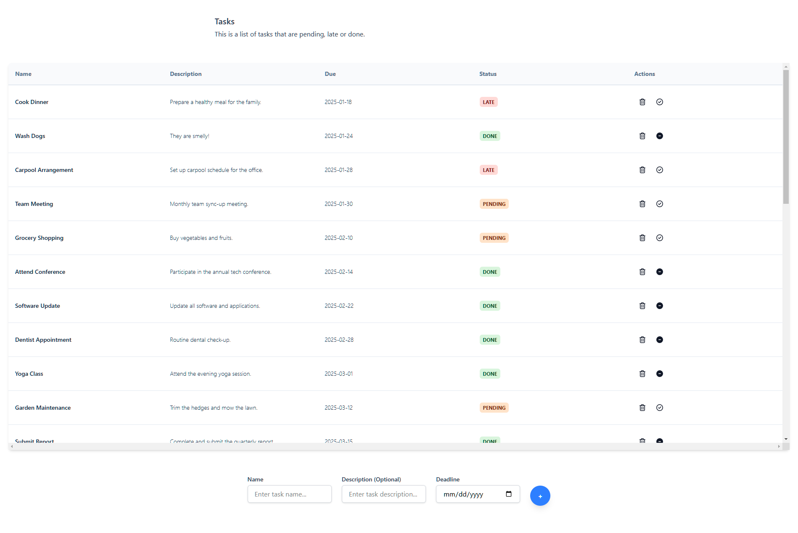

# ToDo App - Clojurescript + Tailwind CSS

Basic to-do app template written on Clojure Script, Re-frame and using Tailwind CSS for styling.

### Features
- Add and remove tasks;
- Mark tasks as done;
- Visual feedback for when tasks are late, pending, done or due today.

### Tools
- [Tailwind](https://tailwindcss.com/)
- [Clojurescript](https://clojurescript.org/)
- [Re-frame](https://github.com/day8/re-frame)

### Usage

At the root of project:
1. `npm install`
2. `npm run watch`

